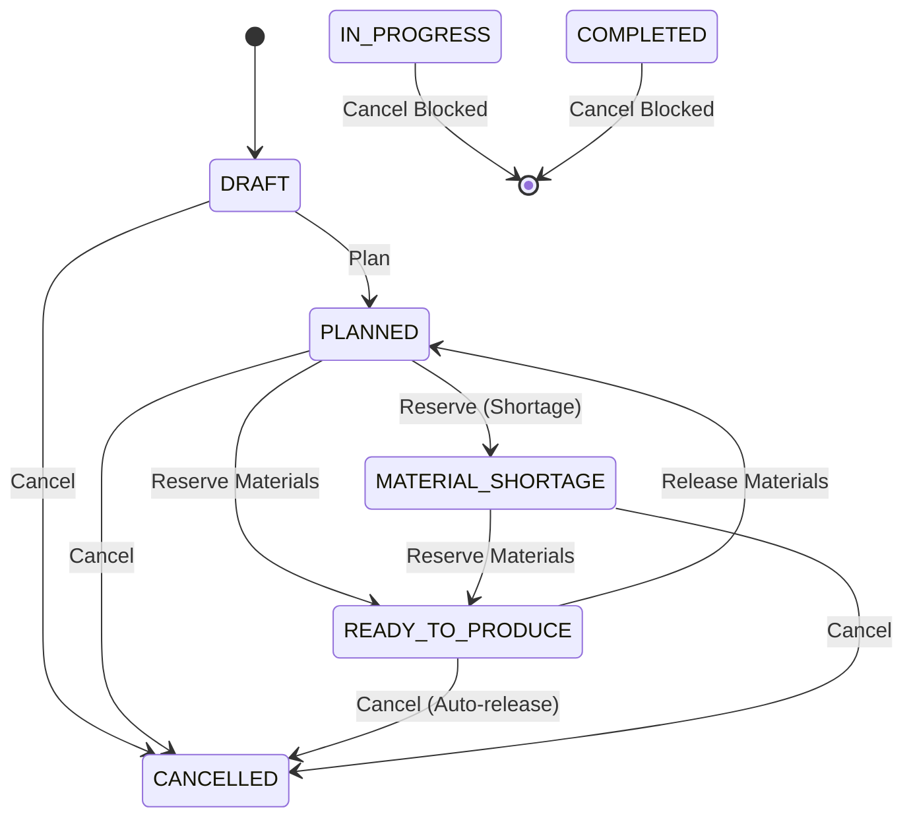

# Data Model: Release and Cancel Work Orders

## Entities & Relationships

### WorkOrder Entity (`work_orders`)
- `id` (UUID, Primary Key)
- `code` (VARCHAR, Unique)
- `finished_product_id` (UUID)
- `bom_id` (UUID)
- `planned_quantity` (DECIMAL)
- `work_order_status_id` (UUID, Foreign Key → `work_order_statuses`)
- `created_by` (UUID)
- `created_at` (TIMESTAMPTZ)

### WorkOrderMaterial Entity (`work_order_materials`)
- `id` (UUID, Primary Key)
- `work_order_id` (UUID, Foreign Key → `work_orders`)
- `material_product_id` (UUID)
- `required_quantity` (DECIMAL)
- `reserved_quantity` (DECIMAL) -- *Set to 0 upon release*
- `consumed_quantity` (DECIMAL)

### StockBalance Entity (`stock_balances`)
- `id` (UUID, Primary Key)
- `warehouse_id` (UUID)
- `location_id` (UUID)
- `product_id` (UUID)
- `lot_id` (UUID)
- `stock_status_id` (UUID, Foreign Key → `stock_statuses`)
- `quantity` (DECIMAL)
- `version` (BIGINT, Optimistic locking column)

### StockMovement Entity (`stock_movements`)
- `id` (UUID, Primary Key)
- `movement_type_id` (UUID, Foreign Key → `movement_types`) -- *`RELEASE_RESERVATION`*
- `product_id` (UUID)
- `lot_id` (UUID)
- `work_order_id` (UUID, Foreign Key → `work_orders`)
- `from_warehouse_id` (UUID)
- `from_location_id` (UUID)
- `to_warehouse_id` (UUID)
- `to_location_id` (UUID)
- `quantity` (DECIMAL)
- `from_status_id` (UUID) -- *`RESERVED`*
- `to_status_id` (UUID) -- *`AVAILABLE`*
- `reason` (VARCHAR)
- `created_by` (UUID)

---

## State Transition Rules

---

## Validation & Business Rules Matrix

| Action | Current WO Status | Material Status | Resulting WO Status | Stock Movements Created |
| :--- | :--- | :--- | :--- | :--- |
| `release-materials` | `READY_TO_PRODUCE` | `RESERVED` > 0 | `PLANNED` | `RELEASE_RESERVATION` |
| `release-materials` | `PLANNED` | `RESERVED` == 0 | `PLANNED` | None (No-op) |
| `release-materials` | `IN_PROGRESS` | Any | Error 400 | Blocked |
| `cancel` | `DRAFT` | `RESERVED` == 0 | `CANCELLED` | None |
| `cancel` | `READY_TO_PRODUCE` | `RESERVED` > 0 | `CANCELLED` | `RELEASE_RESERVATION` |
| `cancel` | `IN_PROGRESS` | Any | Error 400 | Blocked |
