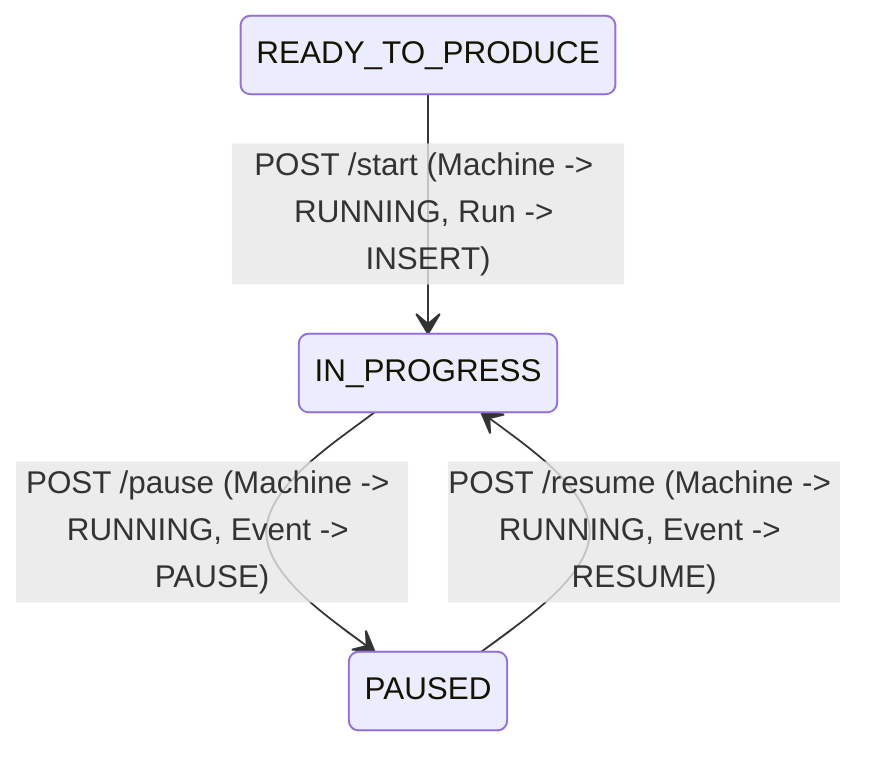

# Data Model: Start, Pause, and Resume Work Orders

## Entities & Relationships

### WorkOrder Entity (`work_orders`)
- `id` (UUID, Primary Key)
- `code` (VARCHAR, Unique)
- `work_order_status_id` (UUID, Foreign Key → `work_order_statuses`)
- `planned_quantity` (DECIMAL)
- `created_at` (TIMESTAMPTZ)

### ProductionRun Entity (`production_runs`)
- `id` (UUID, Primary Key)
- `work_order_id` (UUID, Foreign Key → `work_orders`)
- `machine_id` (UUID, Foreign Key → `machines`)
- `production_line_id` (UUID, Foreign Key → `production_lines`)
- `operator_id` (UUID)
- `start_time` (TIMESTAMPTZ) -- *Populated at Start*
- `end_time` (TIMESTAMPTZ) -- *Null until Complete*
- `actual_quantity` (DECIMAL)
- `good_quantity` (DECIMAL)
- `defect_quantity` (DECIMAL)
- `scrap_quantity` (DECIMAL)

### Machine Entity (`machines`)
- `id` (UUID, Primary Key)
- `code` (VARCHAR, Unique)
- `machine_status_id` (UUID, Foreign Key → `machine_statuses`) -- *`AVAILABLE` → `RUNNING`*

### WorkOrderEvent Entity (`work_order_events`)
- `id` (UUID, Primary Key)
- `work_order_id` (UUID, Foreign Key → `work_orders`)
- `production_run_id` (UUID, Foreign Key → `production_runs`)
- `event_type_id` (UUID, Foreign Key → `work_order_event_types`) -- *`START`, `PAUSE`, `RESUME`*
- `operator_id` (UUID)
- `event_timestamp` (TIMESTAMPTZ)
- `note` (VARCHAR)

---

## State Transition Rules

---

## Validation & Business Rules Matrix

| Action | Current WO Status | Required Machine Status | Target WO Status | Target Machine Status | Created Records |
| :--- | :--- | :--- | :--- | :--- | :--- |
| `POST /start` | `READY_TO_PRODUCE` | `AVAILABLE` | `IN_PROGRESS` | `RUNNING` | `production_runs` (INSERT), `work_order_events` (`START`) |
| `POST /pause` | `IN_PROGRESS` | Any | `PAUSED` | No change (`RUNNING`) | `work_order_events` (`PAUSE`) |
| `POST /resume` | `PAUSED` | Any | `IN_PROGRESS` | No change (`RUNNING`) | `work_order_events` (`RESUME`) |
