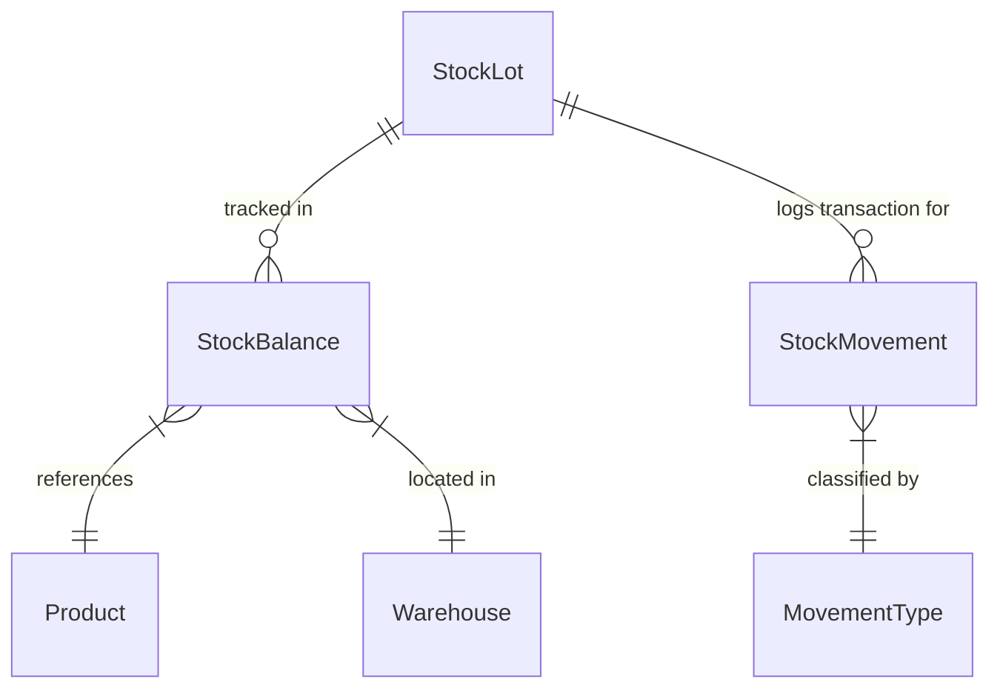

# Data Model Specification: Inventory Application Services

**Feature Branch**: `20260728084808-inventory-services`

## Domain Entities & Attributes

### 1. StockLot
Represents a distinct batch or lot of a manufactured or purchased product.

- **`id`** (`UUID`, Primary Key): Unique lot identifier.
- **`lotNumber`** (`String`, Required, Unique): System or user-assigned unique lot tracking code.
- **`productId`** (`UUID`, Required, Foreign Key to `Product`): The product contained in this lot.
- **`lotTypeId`** (`UUID`, Optional): Type/category of the lot.
- **`expiryDate`** (`LocalDate`, Optional): Date beyond which lot items cannot be used.
- **`createdAt`** (`Instant`, Required): Timestamp when lot was registered.

#### Validation Rules & Constraints:
- `lotNumber` must not be blank and must be unique.
- `productId` must reference a valid active product.
- `expiryDate`, if present, must be after the manufacture date / creation date.

---

### 2. StockMovement
Audit log of all inventory transactions.

- **`id`** (`UUID`, Primary Key): Movement transaction ID.
- **`movementTypeId`** (`UUID`, Required): Identifier for movement classification (RECEIPT, ISSUE, TRANSFER, ADJUSTMENT).
- **`productId`** (`UUID`, Required): Product involved in movement.
- **`lotId`** (`UUID`, Optional): Lot associated with movement.
- **`warehouseId`** (`UUID`, Required): Primary warehouse affected.
- **`locationId`** (`UUID`, Optional): Specific location bin/rack within warehouse.
- **`quantity`** (`BigDecimal`, Required): Transaction quantity (must be > 0).
- **`fromStatusId`** (`UUID`, Optional): Status before movement.
- **`toStatusId`** (`UUID`, Optional): Status after movement.
- **`referenceNo`** (`String`, Optional): Reference document / transaction number (e.g. PO-12345, WO-99812).
- **`reason`** (`String`, Optional): Operational reason or note for movement.
- **`createdBy`** (`UUID`, Required): User ID recording the movement.
- **`createdAt`** (`Instant`, Required): Timestamp when movement was executed.

#### Validation Rules & Constraints:
- `quantity` MUST be positive (> 0).
- `createdBy` MUST be non-null.

---

### 3. StockBalance
Aggregated current on-hand position for a specific product, lot, warehouse, and location bin.

- **`id`** (`UUID`, Primary Key): Balance record ID.
- **`warehouseId`** (`UUID`, Required): Warehouse ID.
- **`locationId`** (`UUID`, Optional): Location bin ID.
- **`productId`** (`UUID`, Required): Product ID.
- **`lotId`** (`UUID`, Optional): Lot ID.
- **`stockStatusId`** (`UUID`, Optional): Inventory quality/availability status ID.
- **`quantity`** (`BigDecimal`, Required): On-hand balance quantity (must be >= 0).
- **`version`** (`Long`, Required): Optimistic locking version integer.
- **`createdAt`** (`Instant`, Required): Record creation timestamp.
- **`updatedAt`** (`Instant`, Required): Record last update timestamp.

#### State & Balance Transitions:
- **`RECEIPT / IN`**: `quantity = quantity + movement.quantity`
- **`ISSUE / OUT`**:
  - `IF quantity < movement.quantity THEN THROW AppException(INSUFFICIENT_STOCK)`
  - `ELSE quantity = quantity - movement.quantity`
- **`TRANSFER`**:
  - Source location: `quantity = quantity - movement.quantity` (verifying quantity >= movement.quantity)
  - Destination location: `quantity = quantity + movement.quantity`

---

## Entity Relationship Diagram

