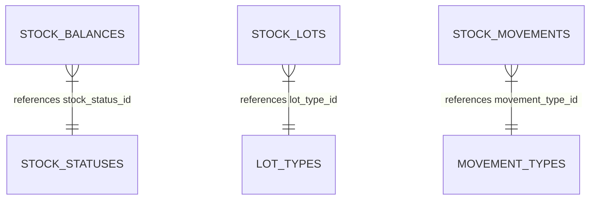

# Data Model Specification: Domain Entity Validation & Value Objects

**Feature Branch**: `20260728104201-domain-validation`

## Database Table Schema Audit (`V20260726194837__init.sql`)

The PostgreSQL database migration defines the lookup tables with `id`, `name`, and `description`:

```sql
CREATE TABLE stock_statuses (
    id          UUID PRIMARY KEY,
    name        VARCHAR(50) NOT NULL UNIQUE,
    description VARCHAR(255)
);

CREATE TABLE lot_types (
    id          UUID PRIMARY KEY,
    name        VARCHAR(50) NOT NULL UNIQUE,
    description VARCHAR(255)
);

CREATE TABLE movement_types (
    id          UUID PRIMARY KEY,
    name        VARCHAR(50) NOT NULL UNIQUE,
    description VARCHAR(255)
);
```

---

## Domain Value Objects & Entities

### 1. StockStatus (Value Object)
- **`id`** (`UUID`): Primary key matching `stock_statuses.id`.
- **`name`** (`String`): Status name (e.g. `"AVAILABLE"`, `"QUARANTINE"`, `"HOLD"`, `"EXPIRED"`, `"SCRAPPED"`).
- **`description`** (`String`): Optional status description.

---

### 2. LotType (Value Object)
- **`id`** (`UUID`): Primary key matching `lot_types.id`.
- **`name`** (`String`): Type name (e.g. `"RAW_MATERIAL"`, `"WORK_IN_PROGRESS"`, `"FINISHED_GOODS"`).
- **`description`** (`String`): Optional type description.

---

### 3. MovementType (Value Object)
- **`id`** (`UUID`): Primary key matching `movement_types.id`.
- **`name`** (`String`): Type name (e.g. `"RECEIPT"`, `"ISSUE"`, `"TRANSFER"`, `"ADJUSTMENT"`).
- **`description`** (`String`): Optional description.

---

### 4. StockBalance (Domain Entity)
- **Fields**: `id` (`UUID`), `warehouseId` (`UUID`), `locationId` (`UUID`), `productId` (`UUID`), `lotId` (`UUID`), `stockStatus` (`StockStatus`), `quantity` (`BigDecimal`), `version` (`Long`), `createdAt` (`Instant`), `updatedAt` (`Instant`).
- **Domain Invariants & Methods**:
  - `create(...)`: Enforces `quantity >= 0` (matching DB constraint `chk_stock_balances_qty_non_negative`).
  - `deductQuantity(BigDecimal amount)`:
    - Throws `IllegalArgumentException` if `amount <= 0`.
    - Throws `IllegalArgumentException` if `amount > quantity` ("Insufficient stock balance").
    - Mutates `quantity = quantity.subtract(amount)`.
  - `addQuantity(BigDecimal amount)`:
    - Throws `IllegalArgumentException` if `amount <= 0`.
    - Mutates `quantity = quantity.add(amount)`.

---

### 5. StockLot (Domain Entity)
- **Fields**: `id` (`UUID`), `lotNumber` (`String`), `productId` (`UUID`), `lotType` (`LotType`), `expiryDate` (`LocalDate`), `createdAt` (`Instant`).
- **Domain Invariants & Methods**:
  - `create(...)`:
    - Throws `IllegalArgumentException` if `lotNumber` is null/blank or `productId` is null.

---

### 6. StockMovement (Domain Entity)
- **Fields**: `id` (`UUID`), `movementType` (`MovementType`), `productId` (`UUID`), `lotId` (`UUID`), `warehouseId` (`UUID`), `locationId` (`UUID`), `quantity` (`BigDecimal`), `fromStatusId` (`UUID`), `toStatusId` (`UUID`), `referenceNo` (`String`), `reason` (`String`), `createdBy` (`UUID`), `createdAt` (`Instant`).
- **Domain Invariants & Methods**:
  - `create(...)`:
    - Throws `IllegalArgumentException` if `quantity <= 0` (matching DB constraint `chk_stock_movements_qty_positive`).
    - Throws `IllegalArgumentException` if `productId`, `warehouseId`, or `createdBy` is null.

---

## Entity Relationship Diagram


