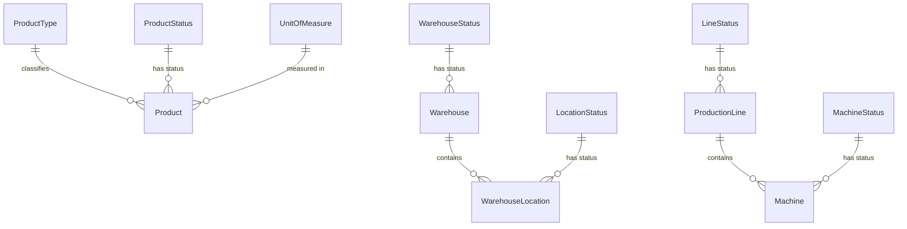

# Data Model: Master Data Management

## Entity Relationship Diagram



## Entities

### 1. Product

| Field | Type | Constraints | Notes |
|-------|------|-------------|-------|
| id | UUID (PK) | Generated by app | `UUID.randomUUID()` |
| code | String(100) | UNIQUE, NOT NULL, @NotBlank | User-assigned, e.g. "SP-001" |
| name | String(255) | NOT NULL, @NotBlank | Display name |
| productTypeId | UUID (FK → product_types) | NOT NULL | System lookup |
| unitId | UUID (FK → units_of_measure) | NOT NULL | System lookup |
| productStatusId | UUID (FK → product_statuses) | NOT NULL, default ACTIVE | Managed by admin |
| version | Long | NOT NULL, default 0 | Optimistic locking |
| createdAt | Instant | NOT NULL | Audit |
| createdBy | UUID | nullable | Reference to users |
| updatedAt | Instant | NOT NULL | Audit |
| updatedBy | UUID | nullable | Reference to users |

**Validation Rules:**
- code: unique across all products (DB unique constraint + app-level check)
- code: must not be blank
- name: must not be blank
- productTypeId: must reference an existing product_type
- unitId: must reference an existing unit_of_measure
- Soft-delete only: never DELETE, only set status to INACTIVE
- Cannot deactivate if referenced in any stock movement
- Version field: optimistic locking on concurrent updates

**State Transitions:**
```
ACTIVE ──→ INACTIVE  (only if no stock movements reference this product)
INACTIVE ──→ ACTIVE  (reactivation — allowed by admin)
```

---

### 2. Warehouse

| Field | Type | Constraints | Notes |
|-------|------|-------------|-------|
| id | UUID (PK) | Generated by app | |
| code | String(100) | UNIQUE, NOT NULL, @NotBlank | e.g. "WH-HN" |
| name | String(255) | NOT NULL, @NotBlank | e.g. "Hanoi Warehouse" |
| address | String(255) | nullable | |
| warehouseStatusId | UUID (FK → warehouse_statuses) | NOT NULL, default ACTIVE | |
| createdAt | Instant | NOT NULL | |
| createdBy | UUID | nullable | |
| updatedAt | Instant | NOT NULL | |
| updatedBy | UUID | nullable | |

**Validation Rules:**
- code: unique across all warehouses
- Cannot deactivate if any active stock exists in its locations

**State Transitions:**
```
ACTIVE ──→ INACTIVE  (only if no active stock in warehouse)
INACTIVE ──→ ACTIVE  (reactivation)
```

---

### 3. WarehouseLocation

| Field | Type | Constraints | Notes |
|-------|------|-------------|-------|
| id | UUID (PK) | Generated by app | |
| warehouseId | UUID (FK → warehouses) | NOT NULL | Parent warehouse |
| code | String(100) | NOT NULL | Unique within warehouse |
| name | String(255) | nullable | Display name |
| locationStatusId | UUID (FK → location_statuses) | NOT NULL, default ACTIVE | |
| createdAt | Instant | NOT NULL | |
| createdBy | UUID | nullable | |
| updatedAt | Instant | NOT NULL | |
| updatedBy | UUID | nullable | |

**Validation Rules:**
- code: unique within the same warehouse (composite uniqueness with warehouseId)
- Duplicate codes allowed across different warehouses
- Cannot stock-in to INACTIVE location

**State Transitions:**
```
ACTIVE ──→ INACTIVE  (blocks new stock-in)
INACTIVE ──→ ACTIVE  (re-enable)
```

---

### 4. ProductionLine

| Field | Type | Constraints | Notes |
|-------|------|-------------|-------|
| id | UUID (PK) | Generated by app | |
| code | String(100) | UNIQUE, NOT NULL, @NotBlank | e.g. "LINE-01" |
| name | String(255) | NOT NULL, @NotBlank | |
| lineStatusId | UUID (FK → line_statuses) | NOT NULL, default ACTIVE | |
| createdAt | Instant | NOT NULL | |
| createdBy | UUID | nullable | |
| updatedAt | Instant | NOT NULL | |
| updatedBy | UUID | nullable | |

**Validation Rules:**
- code: unique across all production lines
- Cannot assign work orders to INACTIVE line (enforced by work order module)

**State Transitions:**
```
ACTIVE ──→ INACTIVE
ACTIVE ──→ MAINTENANCE
MAINTENANCE ──→ ACTIVE
INACTIVE is terminal (reactivation requires admin)
```

---

### 5. Machine

| Field | Type | Constraints | Notes |
|-------|------|-------------|-------|
| id | UUID (PK) | Generated by app | |
| productionLineId | UUID (FK → production_lines) | NOT NULL | Parent line |
| code | String(100) | UNIQUE, NOT NULL, @NotBlank | e.g. "M-001" |
| name | String(255) | NOT NULL, @NotBlank | |
| machineStatusId | UUID (FK → machine_statuses) | NOT NULL, default AVAILABLE | |
| createdAt | Instant | NOT NULL | |
| createdBy | UUID | nullable | |
| updatedAt | Instant | NOT NULL | |
| updatedBy | UUID | nullable | |

**Validation Rules:**
- code: unique across all machines (global uniqueness)
- machineStatusId: must follow valid transitions (see state machine below)

**State Transitions (Machine Status Machine):**

| From ↓ / To → | AVAILABLE | IN_USE | UNDER_MAINTENANCE | BROKEN | INACTIVE |
|---------------|-----------|--------|-------------------|--------|----------|
| AVAILABLE | — | ✅ | ✅ | ❌ | ✅ |
| IN_USE | ✅ | — | ✅ | ✅ | ❌ |
| UNDER_MAINTENANCE | ✅ | ❌ | — | ❌ | ✅ |
| BROKEN | ❌ | ❌ | ✅ | — | ✅ |
| INACTIVE | ❌ | ❌ | ❌ | ❌ | — |

**Status semantics:**
- **AVAILABLE**: Machine ready for production — can start a production run
- **IN_USE**: Machine is actively running — can be stopped, reported faulty, or sent to maintenance
- **UNDER_MAINTENANCE**: Machine being serviced — can return to AVAILABLE when done
- **BROKEN**: Machine has a fault — must be repaired (→ UNDER_MAINTENANCE) or decommissioned
- **INACTIVE**: Terminal state — decommissioned, no further transitions allowed

---

## Lookup Tables (System-Seeded, Read-Only via API)

### product_types
| Name | Description |
|------|-------------|
| RAW_MATERIAL | Input material used in production |
| SEMI_FINISHED | Partially processed product |
| FINISHED_GOOD | Final product ready for delivery |
| CONSUMABLE | Consumable used during production |
| SPARE_PART | Replacement part for machine maintenance |

### product_statuses
| Name | Description |
|------|-------------|
| ACTIVE | Product is in use |
| INACTIVE | Product is discontinued |

### units_of_measure
| Name | Description |
|------|-------------|
| PCS | Pieces |
| KG | Kilogram |
| G | Gram |
| L | Liter |
| ML | Milliliter |
| M | Meter |
| M2 | Square Meter |
| M3 | Cubic Meter |
| BOX | Box |
| SET | Set |
| ROLL | Roll |
| TON | Metric Ton |

### warehouse_statuses / location_statuses / line_statuses
All use ACTIVE / INACTIVE (line also has MAINTENANCE).

---

## Key Business Rules Summary

| Rule | Entity | Enforcement |
|------|--------|-------------|
| Unique code | Product, Warehouse, ProductionLine, Machine | DB constraint + app check |
| Unique location code per warehouse | WarehouseLocation | Composite unique constraint |
| Soft-delete only | Product | Never DELETE, only status change |
| Deactivation guard (has stock) | Product, Warehouse | Check stock movements before deactivation |
| Deactivation guard (active stock) | Warehouse, Location | Check active inventory |
| No stock-in to INACTIVE location | WarehouseLocation | Validate location status |
| No work order to INACTIVE line | ProductionLine | Enforced by work order module |
| Machine status transitions | Machine | Enforce state machine matrix |
| Optimistic locking | Product | Version column |
| ADMIN role for CUD | All | Spring Security @PreAuthorize |
