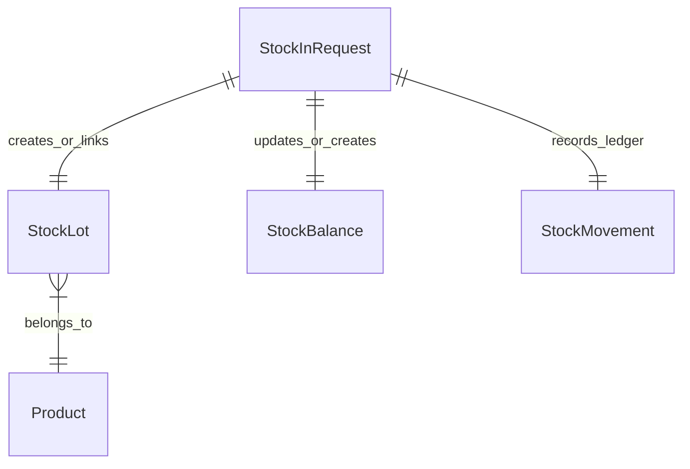

# Data Model & Domain Schema: Stock-In API

## Entities & Relationships

### 1. StockInRequest (Application DTO)
- `productId` (UUID, required): Foreign key to target product.
- `warehouseId` (UUID, required): Foreign key to target receiving warehouse.
- `locationId` (UUID, required): Foreign key to specific warehouse shelf/location.
- `lotNumber` (String, required): Business lot batch number.
- `lotTypeId` (UUID, optional): Foreign key to lot classification.
- `expiryDate` (LocalDate, optional): Batch expiration date.
- `quantity` (BigDecimal, required, > 0): Physical received quantity.
- `referenceNo` (String, required): Purchase order or delivery note reference number.
- `reason` (String, optional): Operator notes or receipt remarks.

### 2. StockLot (Domain Entity)
- `id` (UUID, PK)
- `lotNumber` (String, UNIQUE per product validation)
- `productId` (UUID, FK)
- `lotTypeId` (UUID, FK, nullable)
- `expiryDate` (LocalDate, nullable)
- `createdAt` (Instant)

### 3. StockBalance (Domain Entity)
- `id` (UUID, PK)
- `warehouseId` (UUID, FK)
- `locationId` (UUID, FK, nullable)
- `productId` (UUID, FK)
- `lotId` (UUID, FK, nullable)
- `stockStatusId` (UUID, FK)
- `quantity` (BigDecimal)
- `version` (Long, for optimistic concurrency)
- `updatedAt` (Instant)

### 4. StockMovement (Domain Entity)
- `id` (UUID, PK)
- `movementTypeId` (UUID, FK -> `PURCHASE_IN`)
- `productId` (UUID, FK)
- `lotId` (UUID, FK, nullable)
- `toWarehouseId` (UUID, FK)
- `toLocationId` (UUID, FK, nullable)
- `toStatusId` (UUID, FK)
- `quantity` (BigDecimal)
- `referenceNo` (String)
- `reason` (String, nullable)
- `createdBy` (UUID, FK -> user)
- `createdAt` (Instant)
