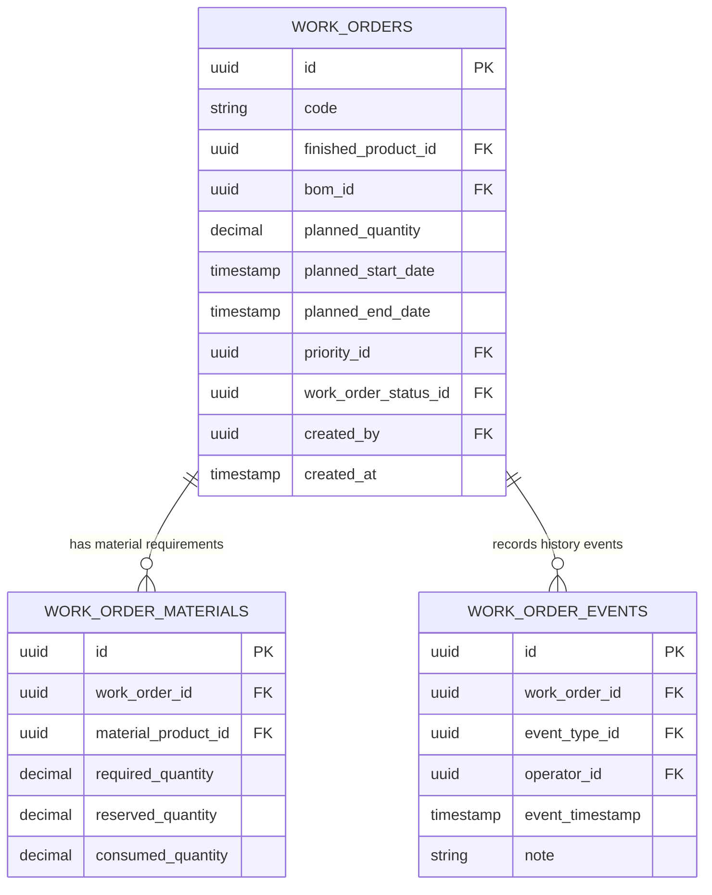

# Data Model: Get Work Order Detail (`GET /api/v1/work-orders/{id}`)

## Entities & DTOs

### 1. `WorkOrderDto` (Response DTO)
```java
public class WorkOrderDto {
    UUID id;
    String code;
    UUID finishedProductId;
    UUID bomId;
    BigDecimal plannedQuantity;
    Instant plannedStartDate;
    Instant plannedEndDate;
    UUID priorityId;
    UUID workOrderStatusId;
    UUID createdBy;
    Instant createdAt;
    List<WorkOrderMaterialDto> materials;
    List<WorkOrderEventDto> events;
}
```

### 2. `WorkOrderMaterialDto` (Child DTO)
```java
public class WorkOrderMaterialDto {
    UUID id;
    UUID workOrderId;
    UUID materialProductId;
    BigDecimal requiredQuantity;
    BigDecimal reservedQuantity;
    BigDecimal consumedQuantity;
}
```

### 3. `WorkOrderEventDto` (Child DTO)
```java
public class WorkOrderEventDto {
    UUID id;
    UUID workOrderId;
    UUID eventTypeId;
    UUID operatorId; // Performer
    Instant eventTimestamp; // Event Time
    String note;
}
```

## Entity Relationships


