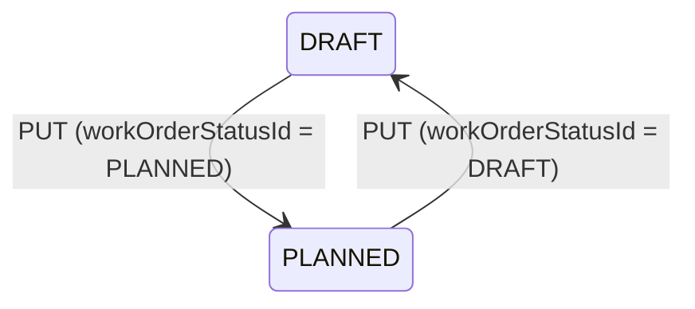

# Data Model: Update Work Order

## Existing Entities (Modified)

### WorkOrder

| Field | Type | Constraints | Notes |
|-------|------|-------------|-------|
| id | UUID | PK | Immutable |
| code | VARCHAR(100) | UNIQUE, NOT NULL | Updatable; uniqueness checked excluding self |
| finished_product_id | UUID | FK → products, NOT NULL | Immutable after creation |
| bom_id | UUID | FK → boms, NOT NULL | Immutable after creation |
| planned_quantity | NUMERIC(18,4) | NOT NULL, CHECK > 0 | Updatable; triggers material recalculation |
| planned_start_date | TIMESTAMPTZ | Nullable | Updatable; must be before planned_end_date |
| planned_end_date | TIMESTAMPTZ | Nullable | Updatable; must be after planned_start_date |
| priority_id | UUID | FK → work_order_priorities, Nullable | Updatable |
| work_order_status_id | UUID | FK → work_order_statuses, NOT NULL | Updatable; only DRAFT ⇄ PLANNED via PUT |
| created_by | UUID | FK → users, Nullable | Immutable |
| created_at | TIMESTAMPTZ | NOT NULL, DEFAULT now() | Immutable |

### WorkOrderMaterial

| Field | Type | Constraints | Notes |
|-------|------|-------------|-------|
| id | UUID | PK | Immutable |
| work_order_id | UUID | FK → work_orders, NOT NULL, ON DELETE CASCADE | Immutable |
| material_product_id | UUID | FK → products, NOT NULL | Immutable |
| required_quantity | NUMERIC(18,4) | NOT NULL | Recalculated when planned_quantity changes |
| reserved_quantity | NUMERIC(18,4) | NOT NULL, DEFAULT 0 | Not modified by PUT update |
| consumed_quantity | NUMERIC(18,4) | NOT NULL, DEFAULT 0 | Not modified by PUT update |

### WorkOrderStatus (Reference/Lookup)

| Field | Type | Constraints | Notes |
|-------|------|-------------|-------|
| id | UUID | PK | Seed data |
| name | VARCHAR(50) | UNIQUE, NOT NULL | Used for guard logic (DRAFT, PLANNED) |
| description | VARCHAR(255) | | Human-readable |
| is_initial | BOOLEAN | NOT NULL, DEFAULT FALSE | |
| is_final | BOOLEAN | NOT NULL, DEFAULT FALSE | |

## New Entities

### None

No new database tables are required. All changes operate on existing tables.

## Validation Rules

| Rule | Field(s) | Error Code |
|------|----------|------------|
| Quantity must be positive | planned_quantity | INVALID_INPUT (400) |
| Start date before end date | planned_start_date, planned_end_date | INVALID_INPUT (400) |
| Code must be unique (excl. self) | code | WORK_ORDER_CODE_EXISTS (400) |
| Status must be DRAFT or PLANNED for update | work_order_status_id | BAD_REQUEST (400) |
| Status transition limited to DRAFT ⇄ PLANNED | work_order_status_id | BAD_REQUEST (400) |
| Work Order must exist | id (path param) | NOT_FOUND (404) |

## State Transitions (via PUT only)



> All other transitions (PLANNED → READY_TO_PRODUCE, etc.) MUST use dedicated Action Endpoints.

## Material Recalculation Formula

When `plannedQuantity` changes on a Work Order in DRAFT or PLANNED status:

```
For each WorkOrderMaterial (matched via BomItem.materialProductId):
  requiredQuantity = newPlannedQuantity × bomItem.quantityPerUnit × (1 + bomItem.scrapRate)
```

Only `required_quantity` is updated. `reserved_quantity` and `consumed_quantity` remain unchanged.
